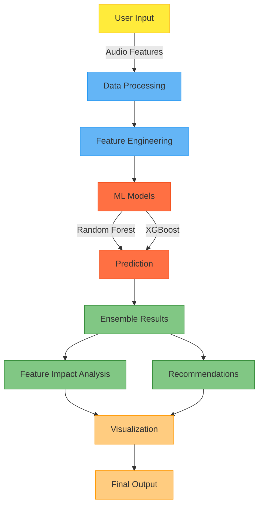

# Spotify Song Popularity Predictor 🎵

A Machine Learning web application that predicts and analyzes song popularity on Spotify using audio features.

Try it out: [Live Demo](https://spotifypopularityprediction-s9jzck5sppfkddyg4vkvhh.streamlit.app/)


## 🎯 Overview

This project uses machine learning to predict a song's potential popularity on Spotify based on its audio characteristics. It combines the power of Random Forest and XGBoost models to provide accurate predictions and actionable insights.

## 🔄 How It Works



### Process Breakdown:

1. **User Input**: 
   - Song audio features input through interactive sliders
   - Features include Energy, Danceability, Loudness, etc.

2. **Data Processing & Feature Engineering**:
   - Normalize and scale input features
   - Create engineered features (feature interactions)
   - Prepare data for model input

3. **ML Models**:
   - Random Forest Regressor
   - XGBoost Regressor
   - Both models trained on Spotify dataset

4. **Analysis & Results**:
   - Ensemble predictions from both models
   - Feature importance analysis
   - Optimization recommendations

5. **Output**:
   - Popularity score prediction
   - Interactive visualizations
   - Actionable recommendations

## ✨ Key Features

- **Popularity Prediction**
  - Real-time predictions using multiple ML models
  - Ensemble averaging for improved accuracy
  - Confidence metrics for predictions

- **Feature Analysis**
  - Interactive visualization of audio features
  - Correlation analysis
  - Feature importance insights

- **Optimization Recommendations**
  - Personalized suggestions for improving popularity
  - Impact analysis of feature modifications
  - Easy-to-follow recommendations

## 🚀 Try It Out

Visit the live application: [Spotify Popularity Predictor](https://spotifypopularityprediction-s9jzck5sppfkddyg4vkvhh.streamlit.app/)

## 🛠️ Installation

```bash
# Clone the repository
git clone https://github.com/Cloudyboiii/Spotify_Popularity_Prediction.git
cd Spotify_Popularity_Prediction

# Create virtual environment
python -m venv venv
source venv/bin/activate  # Linux/Mac
venv\Scripts\activate     # Windows

# Install dependencies
pip install -r requirements.txt

# Run the application
streamlit run app/app.py
```

## 📊 Features Used

| Feature | Description |
|---------|-------------|
| Energy | Intensity and activity measure |
| Danceability | How suitable for dancing |
| Loudness | Overall loudness in dB |
| Valence | Musical positiveness measure |
| Acousticness | Amount of acoustic sound |
| Instrumentalness | Predicts if a track contains no vocals |
| Tempo | Overall estimated tempo in BPM |
| Speechiness | Presence of spoken words |
| Liveness | Presence of audience in recording |

## 💻 Tech Stack

- **Frontend**: Streamlit
- **Machine Learning**: scikit-learn, XGBoost
- **Data Processing**: Pandas, NumPy
- **Visualization**: Plotly
- **Version Control**: Git

## 🔜 Future Updates

- [ ] Additional ML models integration
- [ ] Batch prediction capability
- [ ] Model retraining functionality
- [ ] Enhanced visualization options
- [ ] API endpoint for predictions

## 👨‍💻 Author

**Badal Gupta**
- GitHub: [Cloudyboiii](https://github.com/Cloudyboiii)
- Project Link: [Spotify Popularity Predictor](https://github.com/Cloudyboiii/Spotify_Popularity_Prediction.git)
- Live Demo: [Web Application](https://spotifypopularityprediction-s9jzck5sppfkddyg4vkvhh.streamlit.app/)

## 📄 License

This project is licensed under the MIT License - see the [LICENSE](LICENSE) file for details.

## 🌟 Support

If you found this project helpful or interesting, please consider giving it a ⭐!

## 📧 Contact

For any questions, suggestions, or issues, feel free to reach out through:
- GitHub Issues
- GitHub Discussions
- Email: badal.gupta0408@gmail.com
